 

 

 

 

  
  

  
  

  
  

  
  

  <a href="https://ahmetakyapi.com"><b>See all 13 products on ahmetakyapi.com →</b></a>

 

  
  
  
  
  

📊 &nbsp;GitHub Stats

 

<!-- Every image above is generated by scripts/generate.py — edit the data there and re-run it. -->
